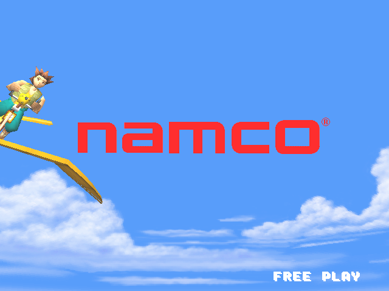
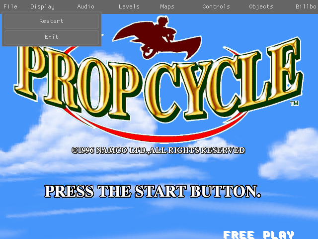
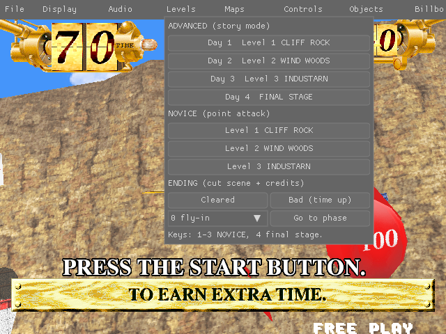
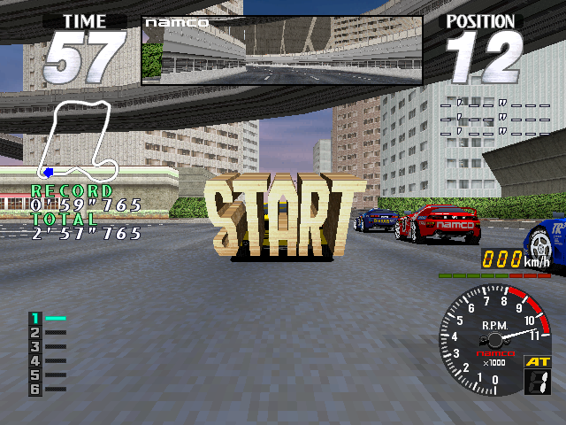

# Prop Cycle for PC

This is the 1996 Namco arcade game **Prop Cycle**, rebuilt so it runs on a
normal computer. You fly a pedal-powered glider and pop balloons.




Press `Esc` any time for the menu:




## What you need

Your own copy of the game file **`propcycl.zip`** (the MAME version).
It is not included here.

## Linux

Open a terminal in this folder and type:

```bash
./install-deps.sh
./build.sh ~/Downloads/propcycl.zip
./launch.sh
```

1. The first line installs the tools it needs. It asks for your password.
2. The second line builds the game. Change the path if your zip is somewhere else.
3. The third line starts the game.

Next time, just type `./launch.sh`.

## Windows

The Windows version is built from Linux. Type:

```bash
./build-windows.sh
```

This makes a `windows-release` folder. Copy it to the Windows computer.
Put `propcycl.zip` in its `roms` folder. Then double-click **PropCycle.exe**.

## How to play

| Key | What it does |
|---|---|
| `5` | Put in a coin |
| `Enter` | Start |
| Arrow keys | Steer and tilt |
| `Esc` | Menu (restart, exit, sound, levels) |
| `P` | Pause. While paused, the arrow keys turn the camera around the rider and `+` / `-` zoom |
| `F12` | Take a picture |

A game controller works too.

## Screen settings

Press `Esc` and open **Display**. Your choices are saved by themselves.

- **Widescreen**: turn it on to fill a wide screen. You see more of the
  world at the sides, not a stretched picture. The time and score gauges
  move out to the corners.
- **Window mode**: a window, or full screen.
- **Resolution**: how many pixels the game draws. It is scaled to fit the
  window, so a smaller number runs faster on a slow computer.
- **Aspect ratio** (when widescreen is off): 4:3 like the arcade screen, or
  stretched to fill the window.

## If it does not work

- **"not installed"**: run `./install-deps.sh` again.
- **"can't be used"**: your zip is the wrong game. You need the one
  called `propcycl`.
- **Black or white screen**: update your graphics driver.

More about the game files: [docs/ROM_SETUP.md](docs/ROM_SETUP.md)

## Coming next: Rave Racer

Namco's **Rave Racer** (System 22) is being rebuilt the same way. It runs
and races, with sound, but it is not in this repository yet.



## How it was made

The game's original program was taken apart with
[Ghidra](https://ghidra-sre.org/) (the NSA's free reverse-engineering tool).
Ghidra's output was then turned into C and fixed by hand, one piece at a
time, by checking it against the arcade machine running in
[MAME](https://www.mamedev.org/).

The sound program is also turned into C. That happens when you build, from
your own copy of the game file.

This repository has **only the code**. It has no game files, no programs
from the arcade board, and none of Ghidra's raw output. Everything the game
shows or plays is read from your own `propcycl.zip`.
