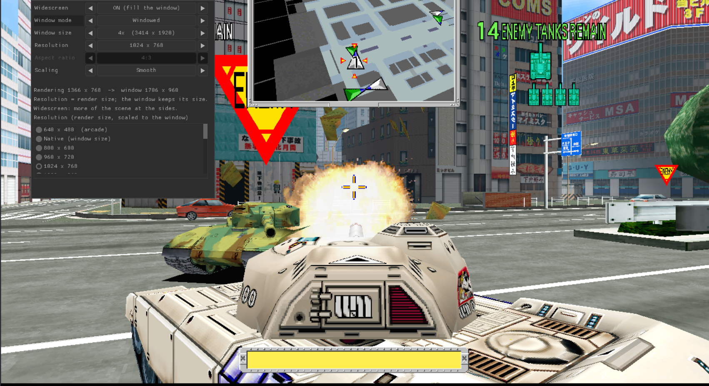
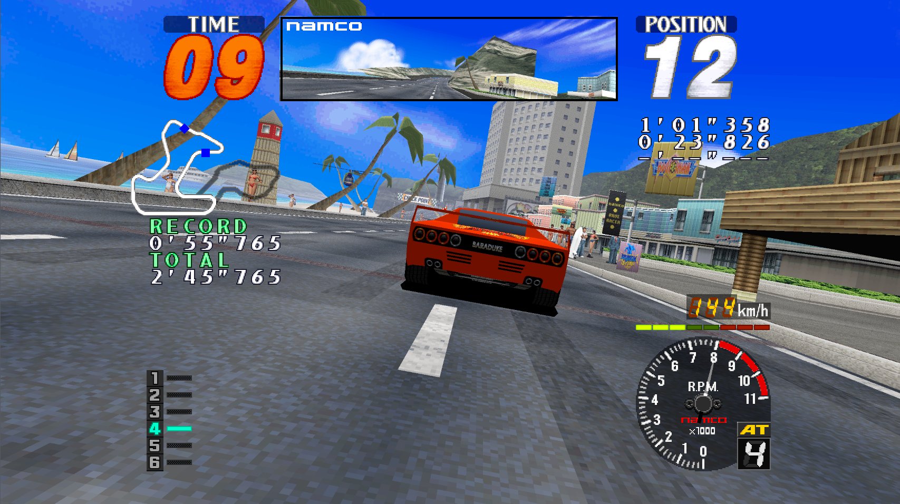
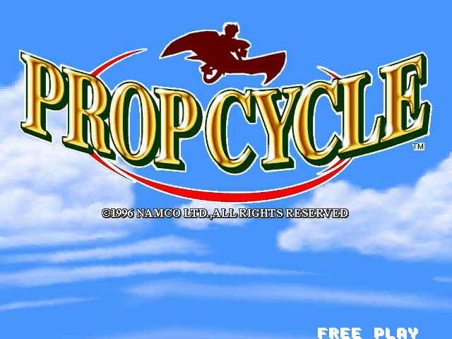
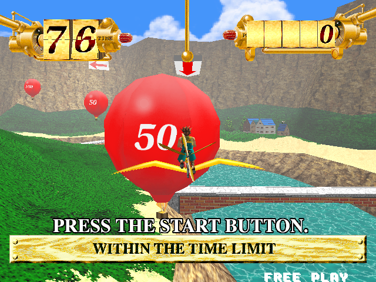
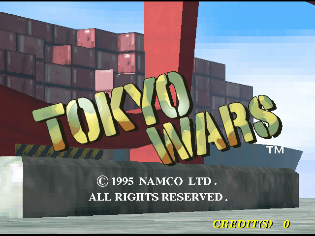

# Namco System 22 games for PC

Namco arcade games from the 1990s, rebuilt so they run on a normal
computer. You need your own copy of each game's files (the MAME versions);
they are not included here.

| Game | Year | Status | Game files you need | Linux | Windows |
|---|---|---|---|---|---|
| **Prop Cycle** | 1996 | Playable from start to finish, with sound | `propcycl.zip` | yes | yes |
| **Rave Racer** | 1995 | Playable: races, with sound | `raverace.zip` + `namcoc74.zip` | yes | yes |
| **Tokyo Wars** | 1996 | Playable: attract, play, sound, widescreen | `tokyowar.zip` | yes | yes |

## How it was made

Each game's original program was taken apart with
[Ghidra](https://ghidra-sre.org/) (the NSA's free reverse-engineering tool)
and checked, piece by piece, against the arcade machine running in
[MAME](https://www.mamedev.org/).

- **Prop Cycle**: Ghidra's output was turned into C and fixed by hand.
- **Rave Racer**: the program is translated to C by a tool of this project
  (`raverace/gen/rr_lifted.c` is its output), and parts are being rewritten
  by hand.
- **Tokyo Wars**: the program is translated to C by the same tool
  (`tokyowar/gen/tw_lifted.c`); its master DSP and sound programs are
  turned into C when you build, from your own copy of the game files.
- The sound programs of all three games are turned into C when you build,
  from your own copy of the game files.

This repository has **only the code**. It has no game files and no Ghidra
project or tools. Everything the games show or play is read from your own
zips.

## Linux

Open a terminal in this folder. First, once:

```bash
./install-deps.sh
```

This installs the tools the games need. It asks for your password.

Then build each game you have. Change the paths if your zips are
somewhere else:

```bash
./build.sh ~/Downloads/propcycl.zip                                       # Prop Cycle
raverace/build.sh ~/Downloads/raverace.zip ~/Downloads/namcoc74.zip        # Rave Racer
tokyowar/build.sh ~/Downloads/tokyowar.zip                                 # Tokyo Wars
```

Rave Racer's and Tokyo Wars' first builds take a few minutes.

Then play:

```bash
./launch.sh prop      # Prop Cycle
./launch.sh rave      # Rave Racer
./launch.sh tokyo     # Tokyo Wars
./launch.sh           # the list of games and options
```

## Windows

All three games run on Windows. The Windows version is built from Linux. Type:

```bash
./build-windows.sh
```

This makes a `windows-release` folder. Copy it to the Windows computer.
Put the game files in its `roms` folder: `propcycl.zip` for Prop Cycle,
`raverace.zip` and `namcoc74.zip` for Rave Racer, `tokyowar.zip` for Tokyo
Wars. Then double-click **PropCycle.exe**, **RaveRacer.exe** or
**TokyoWars.exe**.

## How to play

**Prop Cycle.** You fly a pedal-powered glider and pop balloons.

| Key | What it does |
|---|---|
| `5` | Put in a coin |
| `Enter` | Start |
| Arrow keys | Steer and tilt |
| `Space` | Pedal |
| `Esc` | Menu (restart, exit, sound, levels, screen) |
| `P` | Pause. While paused, the arrow keys turn the camera around the rider and `+` / `-` zoom |
| `F12` | Take a picture |

**Rave Racer.** A street race against the clock.

| Key | What it does |
|---|---|
| `5` | Put in a coin |
| `X` (or Up) | Gas |
| `Z` (or Down) | Brake |
| Left / Right | Steer |
| `A` / `S` | Shift down / up |
| `V` | Change the view |
| `P` | Pause |
| `Esc` | Menu |
| `F12` | Take a picture |

**Tokyo Wars.** You command a tank in a city battle.

| Key | What it does |
|---|---|
| `5` | Put in a coin |
| `Enter` | Start |
| Left / Right (or `A` / `D`) | Steer |
| Up / Down (or `W` / `S`) | Forward / backward pedal |
| `X` / `Z` | Right / left trigger |
| `9` | Service |
| `Esc` | Menu (screen, sound, keys) |
| `P` | Pause |
| `F11` | Full screen |
| `F12` | Take a picture |

A game controller works in all three games. In Rave Racer the keys can be
changed in `raverace/rr_controls.cfg`; in Tokyo Wars, in the menu
(**Controls**) or in `tokyowar/tw_controls.cfg`.

## Pictures

Tokyo Wars:



Rave Racer:



Prop Cycle:




Tokyo Wars, the title screen:



## Screen settings (Prop Cycle and Tokyo Wars)

Press `Esc` and open **Display**. Your choices are saved by themselves.

- **Widescreen**: turn it on to fill a wide screen. You see more of the
  world at the sides, not a stretched picture. The time and score gauges
  move out to the corners.
- **Window mode**: a window, or full screen.
- **Resolution**: how many pixels the game draws. It is scaled to fit the
  window, so a smaller number runs faster on a slow computer.
- **Aspect ratio** (when widescreen is off): 4:3 like the arcade screen, or
  stretched to fill the window.

## If it does not work

- **"not installed"**: run `./install-deps.sh` again.
- **"can't be used"**: the zip is the wrong game or version. Prop Cycle
  needs the one called `propcycl`; Rave Racer needs `raverace` and
  `namcoc74`; Tokyo Wars needs `tokyowar`.
- **Black or white screen**: update your graphics driver.

More about the game files: [docs/ROM_SETUP.md](docs/ROM_SETUP.md)
